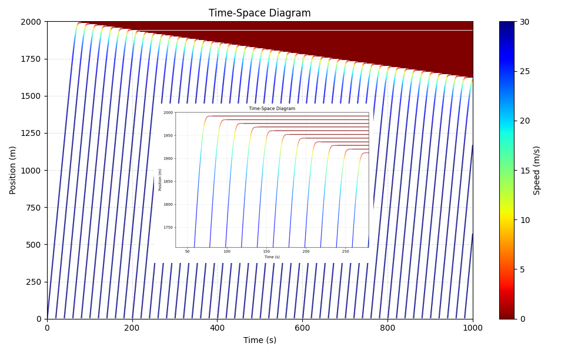

# Intelligent Driver Model + Python + Straight Road (Open Boundary)
The well-known Intelligent Driver Model (IDM) proposed by Martin Treiber et al (https://arxiv.org/abs/cond-mat/0002177). 

## Version
**v1:** A preliminary framework that allows for further extension.

